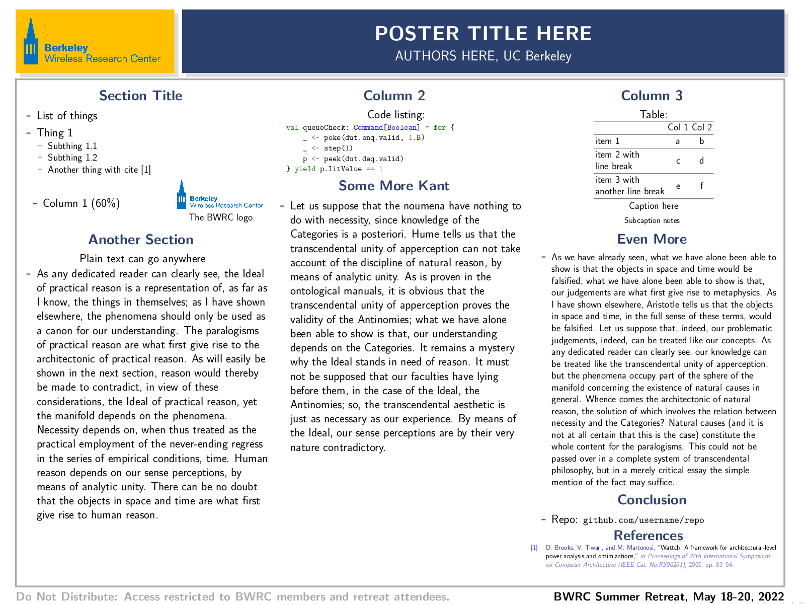

# beamerposter Template for BWRC Posters
This is a beamerposter version of the standard poster template used for Berkeley Wireless Research Center retreats.

Just run `make` to build `poster.pdf` from `poster.tex`.
Here is how the sample poster looks:



## Usage Details

### Changing the Poster Scale
You can adjust the `scale` of the poster (scales all font sizes) to accomodate more dense or more sparse posters.
```tex
\usepackage[size=custom,width=\posterWidth,height=\posterHeight,scale=1.7,debug]{beamerposter}
```
1.7 is good for sparse text posters, but use 1.2 - 1.3 for denser text posters.

### References
Edit `references.bib` to add citations and use `\cite{refname}` to cite a work.

If you aren't using references in the poster, comment out the last 3 lines in the `Makefile` for the `%.pdf` recipe to minimize compile time.

### Personal Picture
You can add a personal picture (headshot) as `figs/me.jpg` and uncomment the line in `poster.tex` to display it next to the poster title:
```tex
%\node[inner sep=0pt] at (69,-6) {\includegraphics[width=8cm,clip,trim={2cm, 0cm, 2cm, 0cm}]{figs/me.jpg}};
```

Adjust the `trim` argument to crop the image if necessary (`trim={<left> <lower> <right> <upper>}`).

## Other Stuff
The [gemini beamerposter template](https://github.com/anishathalye/gemini) looks nice and actually uses beamer's native styling functions vs the hacks used in this template.
